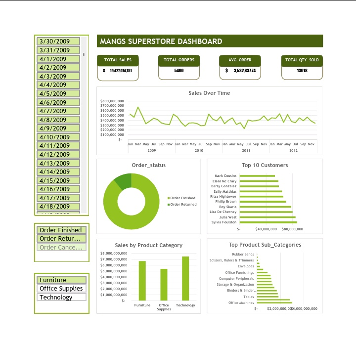

# Superstore Sales Performance Dashboard (Excel)

## 📌 Overview

This project presents a comprehensive sales performance dashboard built using Microsoft Excel. It analyzes transactional data to uncover insights on revenue trends, customer behavior, product performance, and the effect of discounts on sales.

## 🎯 Objectives

* Analyze total sales and order performance
* Identify top-performing product categories and sub-categories
* Evaluate the relationship between discounts and sales
* Examine customer purchasing behavior
* Track sales trends over time

## 📊 Dataset Description

The dataset includes:

* Order ID
* Order Status
* Customer
* Order Date
* Order Quantity
* Sales
* Discount & Discount Value
* Product Category & Sub-category

## 🛠 Tools Used

* Microsoft Excel
* Pivot Tables
* Data Visualization (Charts)
* Dashboard Design

## 📈 Key Metrics

* Total Sales: $19,427,074,751
* Total Orders: 5499
* Average Order Value: $3,532,837.74
* Total Quantity Sold: 13,918

## 🔍 Key Insights

* Technology and Furniture categories contribute significantly to total sales
* Discounts influence purchasing behavior and sales volume
* A small group of customers generate a large portion of revenue
* Sales trends fluctuate over time, indicating seasonal patterns

## 📷 Dashboard Preview

## 🚀 Conclusion

This dashboard provides actionable insights that can help businesses optimize product offerings, improve customer targeting, and enhance revenue strategies.
